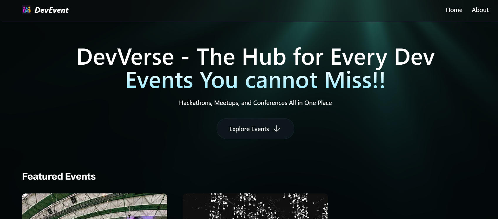
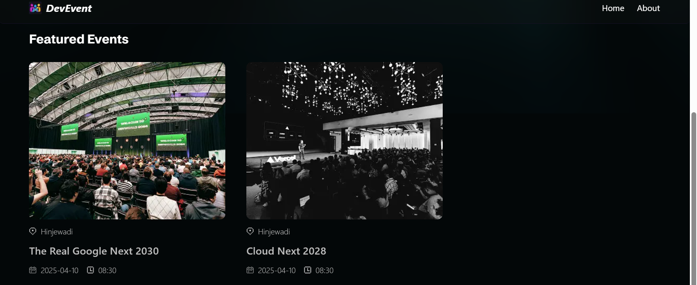
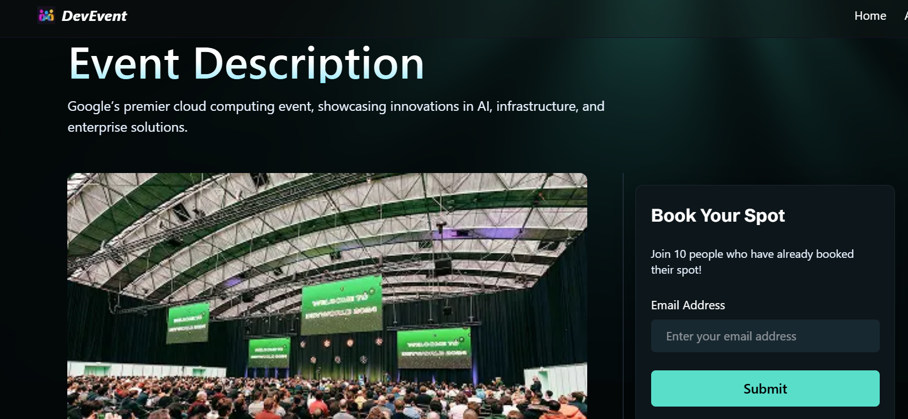
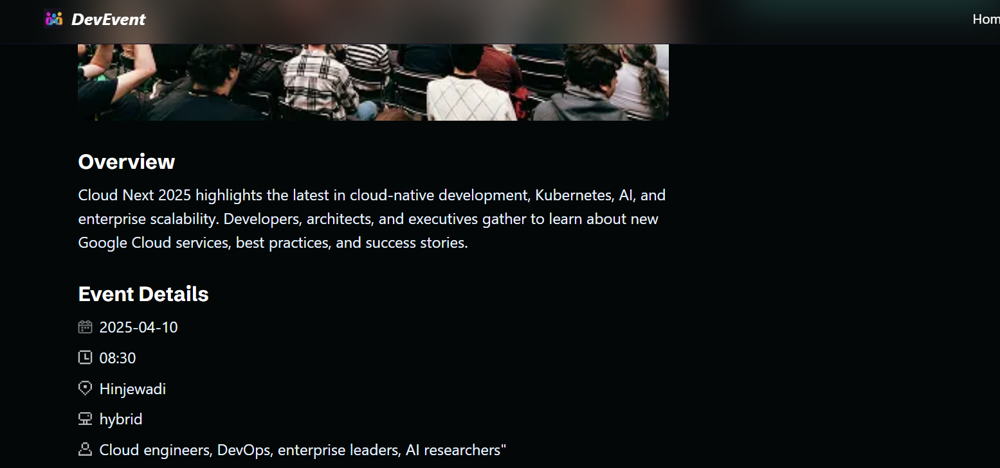
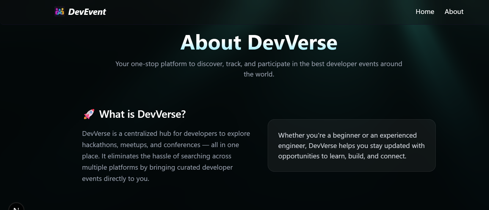
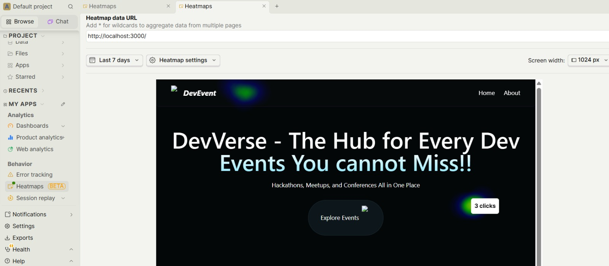
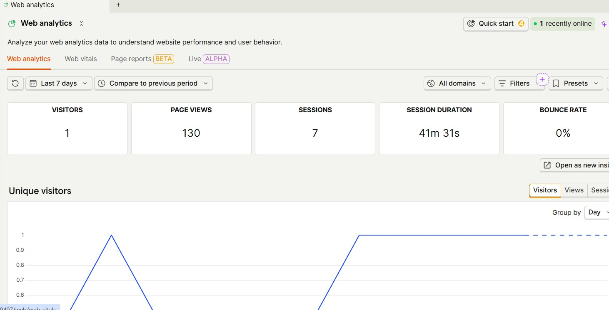
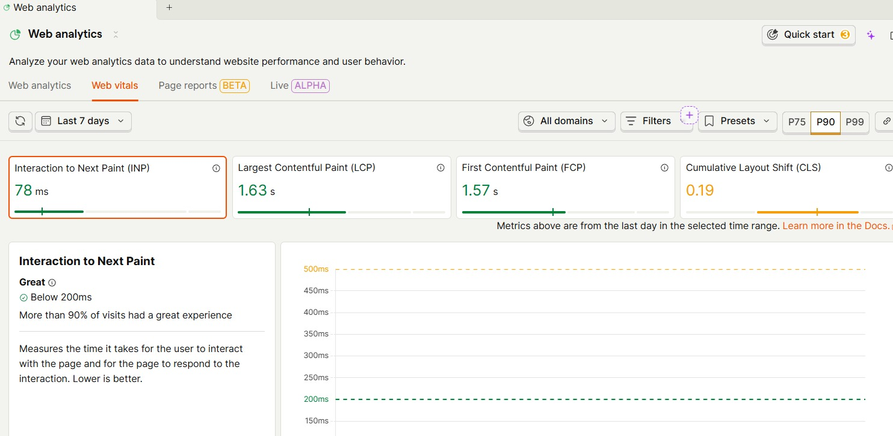

<div align="center">

# 🚀 DevEvent Platform

A production-ready developer event platform where developers can browse and register for hackathons, tech conferences, and community meetups.

[](https://nextjs.org/)
[](https://www.typescriptlang.org/)
[](https://www.mongodb.com/)
[](https://your-deployment-link.vercel.app)

**[🌐 Live Demo](https://dev-verse-beige.vercel.app/)** 

</div>

---

## 📸 Screenshots

> Some beautiful Snippets of the Application

> Home page

> Events 

> Event Details Page


> About Platform

> Heatmap Posthog analytics

> Web Analytics (PostHog)

> Visitors on website

> Web Vitals

> 
---

## ⚙️ Tech Stack

| Tool | Role |
|------|------|
| **Next.js 16** | Framework — SSR, routing with `NextResponse`, server & client components |
| **TypeScript** | Static typing for safer, scalable code |
| **Tailwind CSS** | Utility-first styling |
| **MongoDB + Mongoose** | Database — stores events in flexible document format |
| **Cloudinary** | Cloud image upload, storage, and optimized delivery |
| **PostHog** | Product analytics — tracks user interactions, page views, and event funnels to measure engagement and optimize performance |
| **Postman** | API route testing (GET, POST, PUT, DELETE) |
| **Vercel** | Deployment with GitHub CI/CD |

---

## 🔋 Features

- **Home Page** — Dynamic event listings with Suspense for smooth loading
- **API Routes** — Full CRUD operations for events, tested via Postman
- **Cloudinary Upload** — Image upload and optimized CDN delivery for event banners
- **Event Details Page** — Registration button + similar event suggestions
- **Next.js 16 Caching** — New caching model for improved performance
- **PostHog Analytics** — Tracks clicks, registrations, and user journeys across the platform
- **SEO Optimized** — Dynamic metadata and Open Graph tags per event page

---

**🔍 What PostHog tracks in this app:**

- **Page Views** — every route visit is automatically captured, so you know which pages get the most traffic
- **Event Registration Clicks** — custom event fired when a user clicks "Register", tracking conversion rate per event
- **Session Recording** — records actual user sessions to watch how people navigate the platform
- **Funnel Analysis** — tracks the drop-off between visiting an event page → clicking register → completing registration
- **User Identification** — identifies returning users to track their journey across multiple sessions
- **Feature Flags** — can be used to toggle new features on/off for specific users without redeploying
- **Heatmaps** — shows where users click most on the home page and event detail pages
- **Performance Monitoring** — tracks Web Vitals like LCP, FID, and CLS to catch performance regressions
- **Custom Dashboard** — built a PostHog dashboard to monitor daily active users, popular events, and registration trends

---

**How it's integrated technically:**

- Wrapped the app in `<PostHogProvider>` inside `layout.tsx` so analytics runs globally
- Used `posthog.capture('event_name', { properties })` for custom events like button clicks
- PostHog runs as a **client component** since it needs browser access — kept it isolated so it doesn't affect server components
- Environment variables (`NEXT_PUBLIC_POSTHOG_KEY`) keep the API key safe and out of the codebase

---


## 🚀 Getting Started

```bash
git clone https://github.com/your-username/dev-event-platform.git
cd dev-event-platform
npm install
cp .env.example .env.local   # fill in your keys
npm run dev
```

### Environment Variables

```env
MONGODB_URI=your_mongodb_connection_string

NEXT_PUBLIC_CLOUDINARY_CLOUD_NAME=your_cloud_name
CLOUDINARY_API_KEY=your_api_key
CLOUDINARY_API_SECRET=your_api_secret

NEXT_PUBLIC_POSTHOG_KEY=your_posthog_key
NEXT_PUBLIC_POSTHOG_HOST=https://app.posthog.com
```

---

## ☁️ Deployment

Deployed on **Vercel** via GitHub CI/CD. Each feature was developed on a separate branch and merged into `main` before deployment.

---

